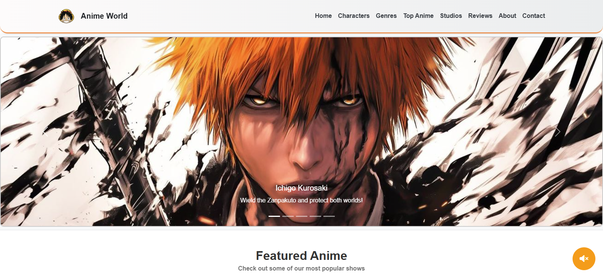
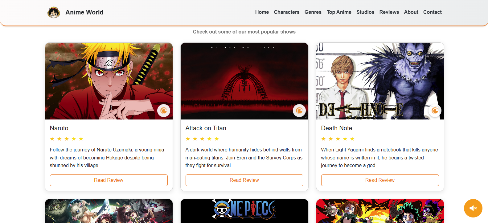
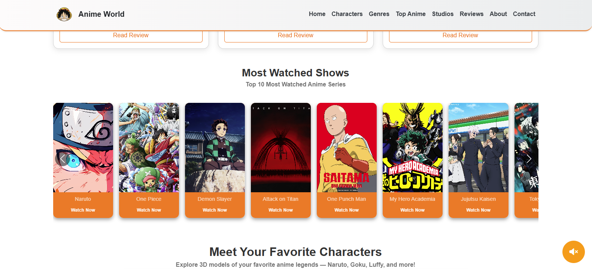
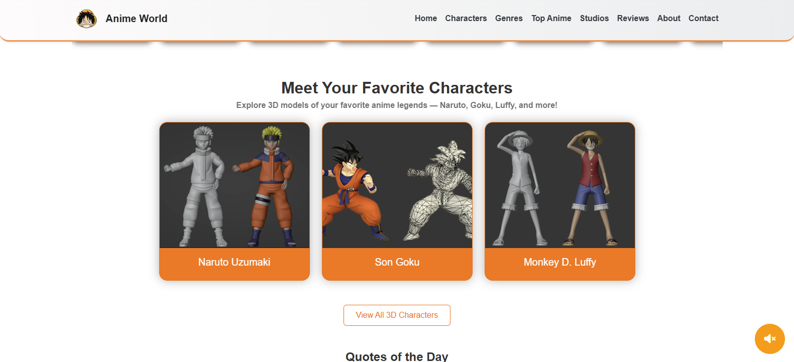
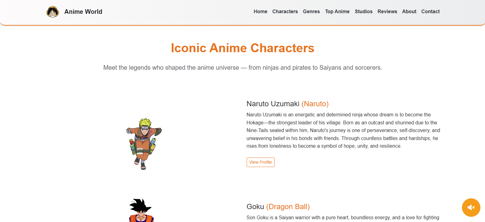
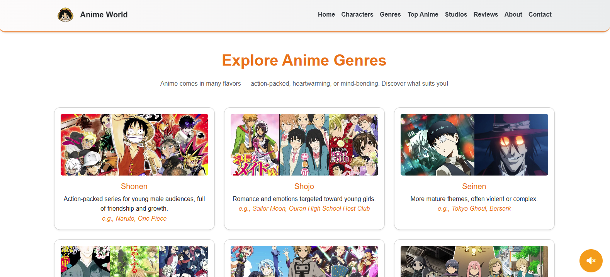
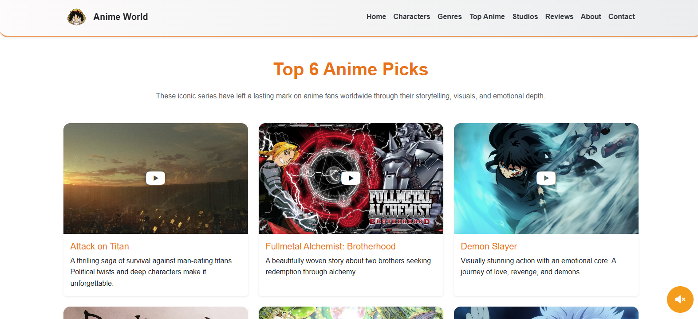

# Anime Website 

A fully responsive and interactive anime-themed website built using HTML, CSS, JS, and Bootstrap. This project showcases popular anime series, character profiles, user reviews, and famous animation studios.

## Live Demo

Visit the live site: [https://faraz-abbasi.github.io/anime-website](https://faraz-abbasi.github.io/anime-website)

## Features

- Home page with carousels, genres, and trailers
- Character profiles with images and descriptions
- Anime reviews with star ratings
- Studio pages with founding details and official links
- Responsive layout with Bootstrap

## Technologies Used

- HTML5
- CSS3
- Bootstrap 5
- Font Awesome
- Google Fonts

## Preview









##  Getting Started

To run the site locally:

1. Clone this repository  
   ```bash
   git clone https://github.com/faraz-abbasi/anime-website.git
